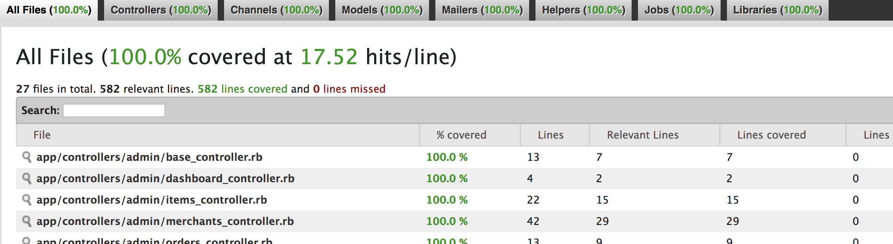
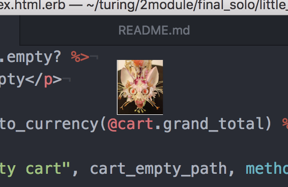

# Litte Shop - Extensions

BE Mod 2 Final Solo Project

## Background and Description
"Little Shop of Orders" is a fictitious e-commerce platform where users can register to place items into a shopping cart and checkout. Merchant users can mark items as 'fulfilled,' and Admin users can mark orders as 'complete.'  Each user role has access to some or all CRUD functionality for application models.

## Final Solo Project - Student must pick 2 extensions:
---

## Slugs (counts as 1 extension point)

All paths for users and items should change from `/users/5` or `/items/17` to use "slugs" such as `/user/iandouglas` or `/items/awesome-widget-2000`

The slug will need to be saved in the `users` able and `items` table, respectively.
Admins have the ability to update a 'slug' for a user or item, and these `update` methods should exist under admin-only namespaced routes.

Since user's first and last names are not unique, use their email address instead. Look into "URL encoding" for working with the `@` symbol in URI paths.

Do not use any third-party gems for this work.

#### Mod 2 Learning Goals reflected:

- Additional database migrations
- ActiveRecord
- Rails routing
- Namespacing
- Software Testing

---
---

## Bulk Discount (counts as 1 extension point)

Merchants can implement bulk discount rates on their inventory. When a user sets their cart quantity to a certain level, those discounts get applied. For example, a merchant might set bulk discounts this way:
- 1 to 10 of a single item, no discount
- 10 to 20 of a single item, 5% discount on that item's price
- 20+ of a single item, 10% discount on that item's price

You'll need to build CRUD pages to manage this.

Merchants must be able to include mutiple bulk discounts, but only one type. For example, a merchant cannot have bulk discounts that are both dollar-based ($10 off $30 or more) AND a percentage-off (15% off 20 items or more) at the same time.

#### Mod 2 Learning Goals reflected:

- Database relationships and migrations
- Advanced ActiveRecord
- Software Testing
- HTML/CSS layout and styling

---
## Testing

I used RSpec to test all files and SimpleCov to keep track of my covered files.
I used FactoryBot for help with test data creation.

## Additional Background & Authorship
Ian Douglas created the base data from which I built the extensions.  These extensions come after a group project I was a part of last week with the same premise of a fictitious e-commerce site.  My group modeled our project after the 1960s film __Little Shop of Horrors__, and a fun hold-over from that is a very creepy image that sometimes pops up on my computer screen for no reason:

The above is an item we sold in our fictitious shop, and now it looks like it's coming with me for the rest of the life of my computer.

## Ruby version
My Ruby Version is 2.4.5

## Other Project Requirements
- must use Rails 5.1.x
- must use PostgreSQL
- must use 'bcrypt' for authentication
- all controller and model code must be tested via feature tests and model tests, respectively
- must use good GitHub branching, team code reviews via GitHub comments, and use of a project planning tool like waffle.io
- must include a thorough README to describe their project

## Permitted
- use FactoryBot to speed up your test development
- use "rails generators" to speed up your app development

## Not Permitted
- do not use JavaScript for pagination or sorting controls
